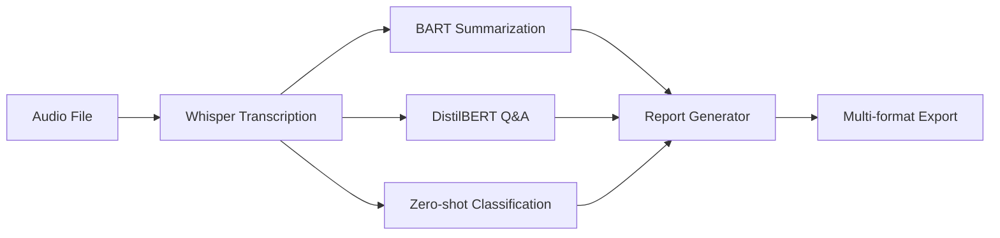

# 🎙️ Meeting Transcription & Report Generator

AI-powered meeting transcription and analysis tool that automatically generates structured reports using the Outline Method. Built with OpenAI Whisper and HuggingFace Transformers, optimized for 500 concurrent users.

---

## 📋 Technical Overview

### Core Technologies
- **Audio Transcription**: OpenAI Whisper (tiny/base/small/medium models)
- **AI Analysis**: HuggingFace Transformers
  - BART (Summarization)
  - DistilBERT (Q&A Extraction)
  - Zero-shot Classification (Priority Detection)
- **Frontend**: Streamlit
- **PDF Generation**: FPDF2
- **Audio Processing**: FFmpeg

### Architecture Highlights
- **Model Caching**: `@st.cache_resource` for shared model instances across users
- **Session State Management**: Persistent report data without reprocessing
- **Async Processing**: Progress tracking with callback functions
- **Resource Optimization**: Chunked text processing for memory efficiency
- **Multi-format Export**: TXT, Markdown, PDF, JSON

---

## 🎯 Functional Description

### Input Processing
1. **Audio Upload**: Accepts MP3, WAV, M4A, WebM, MP4, FLAC, OGG (up to 500MB)
2. **Meeting Metadata**: Optional title, date, time, location, organizer, attendees
3. **Model Selection**: User-configurable Whisper model size (performance vs. accuracy)

### Processing Pipeline



### AI Analysis Components

#### 1. **Transcription Module**
- Converts audio to timestamped text using Whisper ASR
- Segments audio into manageable chunks
- Generates speaker-agnostic transcript with timing information

#### 2. **Summarization Engine**
- Uses BART-large-CNN for abstractive summarization
- Processes long transcripts via chunking (1024 token limit)
- Generates concise executive summary

#### 3. **Insight Extraction**
- Q&A pipeline answers structured questions:
  - Meeting objective/purpose
  - Decisions made
  - Concerns/issues raised
  - Next steps
  - Deadlines mentioned
  - Task owners/assignees

#### 4. **Action Item Detection**
- Keyword-based filtering for action-oriented sentences
- Zero-shot classification for priority levels:
  - 🔴 **HIGH**: Urgent/critical tasks
  - 🟡 **MEDIUM**: Standard follow-ups
  - 🟢 **LOW**: Optional/informational items
- Confidence scoring for reliability

#### 5. **Key Takeaways Identification**
- Importance scoring of individual sentences
- Zero-shot classification with importance labels
- Returns top N most significant points

### Output Formats

#### Text Report (Outline Method Structure)
```
═══════════════════════════════════════
           MEETING REPORT
        (Outline Method Format)
═══════════════════════════════════════

📋 MEETING BASICS (The Five Ws)
────────────────────────────────────────
  📌 Title, 📅 Date, 🕐 Time
  📍 Location, 👤 Organizer, 👥 Attendees

🎯 MEETING OBJECTIVE
────────────────────────────────────────
  [AI-extracted primary purpose]

📝 EXECUTIVE SUMMARY
────────────────────────────────────────
  [Concise AI-generated summary]

⭐ KEY TAKEAWAYS
────────────────────────────────────────
  1. [Most important point]
  2. [Second most important]
  ...

✅ DECISIONS MADE
────────────────────────────────────────
  [AI-extracted decisions]

⚠️ CONCERNS & ISSUES RAISED
────────────────────────────────────────
  [Problems/challenges discussed]

📋 ACTION ITEMS (Prioritized)
────────────────────────────────────────
  🔴 [HIGH]   1. [Urgent task]
  🟡 [MEDIUM] 2. [Standard task]
  🟢 [LOW]    3. [Optional task]

📅 NEXT STEPS & FOLLOW-UPS
────────────────────────────────────────
  [Action plan, deadlines, owners]

📜 FULL TRANSCRIPT (With Timestamps)
────────────────────────────────────────
  [00:00 → 00:15] [Speaker text]
  [00:15 → 00:32] [Speaker text]
  ...
```

#### Additional Formats
- **Markdown**: Same structure, markdown-formatted
- **JSON**: Structured data for API integration
- **PDF**: Professional formatted document (Latin-1 safe)

---

## 🌍 Multi-Language Support

### Supported Languages
| Language | Code | UI Translation | Transcription |
|----------|------|----------------|---------------|
| English | `en` | ✅ | ✅ |
| Spanish | `es` | ✅ | ✅ |
| French | `fr` | ✅ | ✅ |
| Chinese | `zh` | ✅ | ✅ |
| German | `de` | ✅ | ✅ |
| Bangla | `bn` | ✅ | ✅ |

**Note**: Whisper supports 90+ languages for transcription. UI translations available for 6 languages above.

---

## 🚀 Quick Start

### Installation

1. **Clone Repository**
```bash
git clone https://github.com/yourusername/meeting-transcription.git
cd meeting-transcription
```

2. **Install Dependencies**
```bash
pip install -r requirements.txt
```

3. **Install System Dependencies** (Linux/Mac)
```bash
# Ubuntu/Debian
sudo apt-get install ffmpeg libsndfile1

# MacOS
brew install ffmpeg
```

### Running Locally

```bash
streamlit run app.py --server.maxUploadSize=500
```

Access at: `http://localhost:8501`

### Deployment on Streamlit Cloud

1. Push code to GitHub
2. Create `packages.txt` with system dependencies:
   ```
   ffmpeg
   libsndfile1
   ```
3. Connect repository in Streamlit Cloud
4. Deploy!

---

## ⚙️ Configuration

### Model Selection Guidelines

| Model | Size | Speed | Accuracy | Recommended For |
|-------|------|-------|----------|-----------------|
| Tiny | 39M | ⚡⚡⚡⚡⚡ | ⭐⭐⭐ | Testing, low-resource |
| Base | 74M | ⚡⚡⚡⚡ | ⭐⭐⭐⭐ | **500 users, production** |
| Small | 244M | ⚡⚡⚡ | ⭐⭐⭐⭐⭐ | High accuracy needs |
| Medium | 769M | ⚡⚡ | ⭐⭐⭐⭐⭐⭐ | Maximum accuracy |

### Performance Optimization

**For 500 Concurrent Users:**
- Use **Base** model (best speed/accuracy balance)
- Enable model caching (already implemented)
- Deploy on cloud with sufficient RAM (4GB+ recommended)
- Consider horizontal scaling with load balancer

**Resource Requirements:**
- **Base Model**: ~2GB RAM per instance
- **Small Model**: ~4GB RAM per instance
- **CPU**: 2+ cores recommended
- **GPU**: Optional, 10x faster with CUDA

---

## 📊 Use Cases

- **Corporate Meetings**: Board meetings, team syncs, client calls
- **Academic**: Research interviews, focus groups, lectures
- **Legal**: Depositions, client meetings, case discussions
- **Healthcare**: Patient consultations, team huddles (HIPAA considerations)
- **Media**: Podcast/interview transcription and analysis
- **Remote Work**: Async meeting summaries for distributed teams

---

## 🛠️ Troubleshooting

### Common Issues

**1. FFmpeg Not Found**
```bash
# Install FFmpeg
sudo apt-get install ffmpeg  # Linux
brew install ffmpeg          # Mac
choco install ffmpeg         # Windows
```

**2. Out of Memory**
- Use smaller Whisper model (tiny/base)
- Reduce audio file size
- Increase server RAM allocation

**3. PDF Generation Fails**
- Unicode characters not supported in PDF
- Use TXT or Markdown format instead
- App continues working, only PDF unavailable

**4. Slow Processing**
- Choose smaller Whisper model
- Consider GPU acceleration
- Use shorter audio clips for testing

---

## 📄 File Structure

```
meeting-transcription/
├── app.py                      # Main Streamlit application
├── requirements.txt            # Python dependencies
├── packages.txt               # System dependencies (Streamlit Cloud)
├── README.md                  # This file
└── .streamlit/
    └── config.toml            # Streamlit configuration (optional)
```

---

## 🔒 Privacy & Security

- **Data Processing**: All processing happens on server, files deleted after processing
- **No Data Storage**: Transcripts stored only in session state (temporary)
- **Audio Files**: Automatically deleted after transcription
- **Recommendation**: Deploy on private infrastructure for sensitive meetings

---

## 🤝 Contributing

Contributions welcome! Areas for improvement:
- Additional language translations
- Speaker diarization (identify who said what)
- Real-time streaming transcription
- Integration with calendar systems (Google Calendar, Outlook)
- Custom AI model fine-tuning

---

## 📝 License

MIT License - see [LICENSE](LICENSE) file for details

---

## 🙏 Acknowledgments

- **OpenAI Whisper**: State-of-the-art speech recognition
- **HuggingFace**: Transformer models and pipelines
- **Streamlit**: Rapid web app framework
- **FPDF2**: PDF generation library

---

## 📧 Support

- **Email**: go.rashadul@gmail.com

---

**Built with ❤️ for productive meetings**
